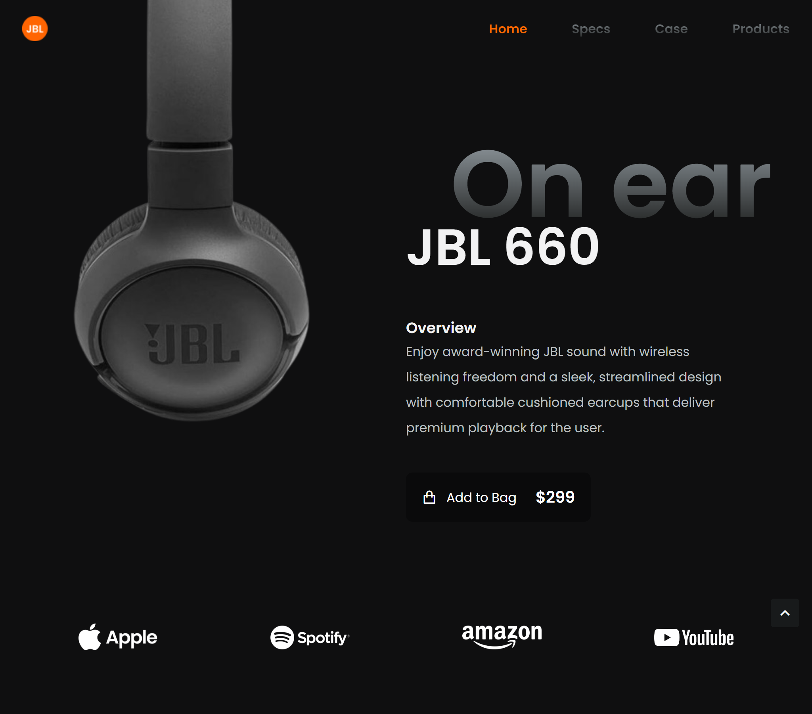
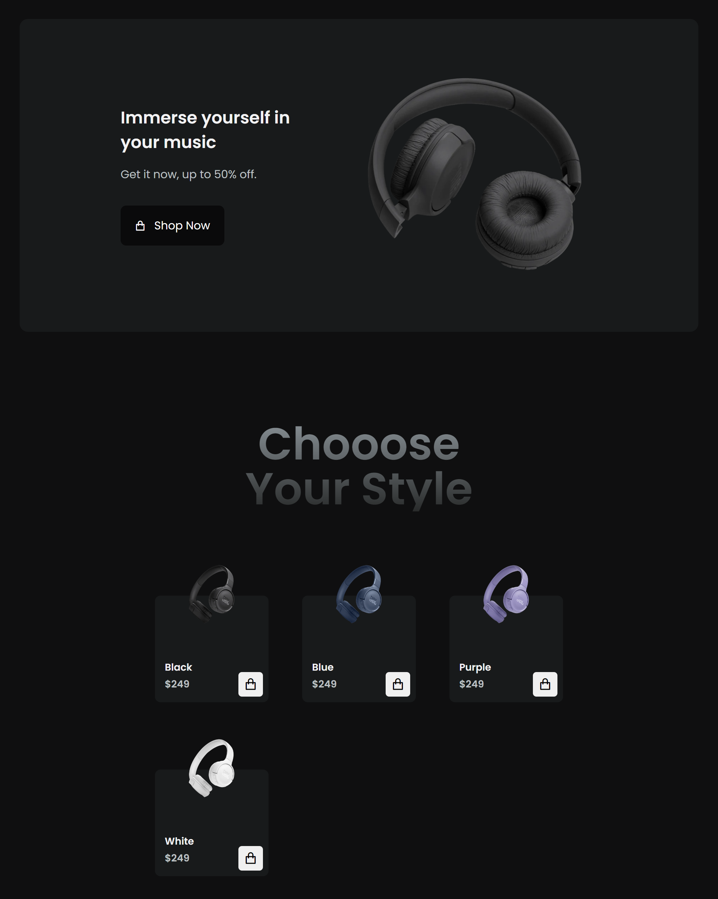
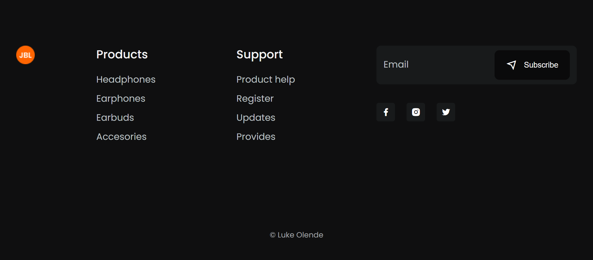

# Headphones Website

This is a responsive website designed for a headphone brand, showcasing various headphone models with their features, specifications, and prices.
The project is built using HTML, CSS, and JavaScript.

## Features

- Responsive Design: The website is fully responsive, ensuring optimal display on devices of all sizes, including desktops, tablets, and mobile phones.
- Interactive UI: Smooth transitions, animations, and user interactions using CSS and JavaScript.
- Product Showcase: Different headphone models are showcased with images, descriptions, and prices.
- Navigation: Simple and intuitive navigation through the website.
- Contact Section: A contact form for customer inquiries.

## Technologies Used

- HTML5: Structuring the content of the website.
- CSS3: Styling the website and ensuring responsiveness.
- JavaScript: Adding interactivity to the website.
- Dynamic content update. Smooth scrolling and other UI enhancements

## Installation

To run this project locally:

1. Clone the repository:
   `git clone https://github.com/LukeOlende/Headphones-Web.git`

2. Navigate to the project directory:
   `cd Headphones-Web`

3. Open index.html in your browser

## Screenshots

## Contributions

Feel free to submit issues or pull requests if you would like to contribute to the project.

## License

This project is licensed under the MIT License.
